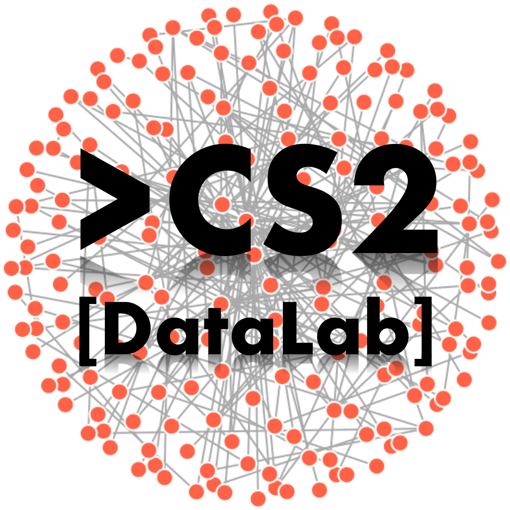
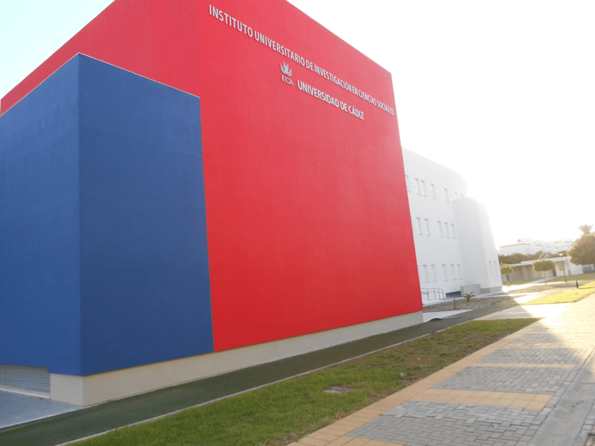

---
header:
  caption: ""
  image: ""
title: CS2 DataLab
view: 1
---

### What is the CS2-DataLab?
CS2-DataLab is an interdisciplinary laboratory where professors, researchers, and MA/MSc/PhD students
coming from different disciplines and diverse methodological background tackle similar social problems
through the use of computational methods and a complex systems perspective. CS2 is conceived as an
open research facility, which is aimed to promote computational social research and doctoral training, but
also transference activities.

### Who we are?
Our team is composed by professors and researchers from different departments that are part of the
University Institute of Research for Social Sustainable Development (INDESS) at the University of Cadiz
(UCA). CS2 is conceived as an open-access multidisciplinary research forum, where social and
behavioural scientists, mathematicians, health researchers, humanities scientists, physicists, and computer
scientists share knowledge and cooperate side-by-side to come up with innovative solutions and theory-
grounded models to explain complex social phenomena.

### What we do?
The role of the CS2 aims to address the Big Problems of contemporary society, but also to increase social
equity and efficiency through better policy planning and delivery of community services. Our team brings
together a new collaboration from across the INDESS and other external research institutions, with
expertise in computational social science and decision analytics. We facilitate evidence-based decision
making across all societal levels, including local, regional, national and international. CS2 applies
innovative approaches to social data analysis and visualisation for advancing social research and policy
planning. We also develop research tools to help policy makers and private companies in complex social
issues.

### Research streams:
+ Social determinants of health: social inequality and inequity in health
+ Social sustainable development: environment, society and territory
+ Complex social systems and the emergence of collective phenomena
+ Computational methods and decision support tool for policy planning
+ Efficacy and efficiency in health and social service provision
+ Communication, internet, and social networks
+ Digital humanities: digital culture and society

